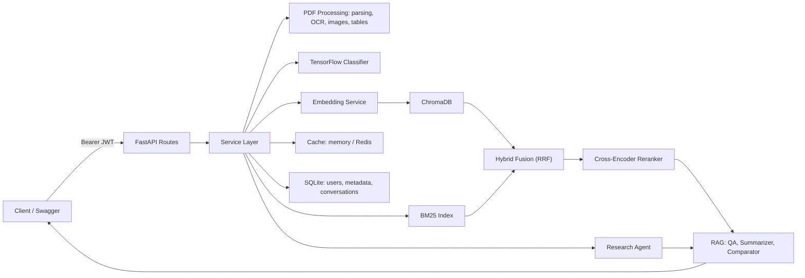

# AI Research & Knowledge Assistant

A multi-user backend for uploading research papers and technical documents,
searching across them with semantic, keyword, and hybrid retrieval, asking
grounded questions with citations, comparing and summarizing documents,
classifying them by domain, and running a lightweight research agent -- all
behind JWT authentication with per-user data isolation.

## Overview

Organizations accumulate large libraries of PDFs -- papers, specs,
whitepapers -- that are hard to search and easy to lose context in. This
service ingests those documents, indexes them for both semantic and
keyword retrieval, and answers questions strictly grounded in the retrieved
content, with page-level citations and a clear fallback when the answer
isn't in the corpus. Every user's documents, searches, conversations, and
analytics are isolated from every other user's.

## Features

**Document management**
- Multi-PDF upload with background processing
- Page-accurate text extraction (PyMuPDF)
- Page-aware overlapping chunking
- OCR fallback for scanned pages (Tesseract), with a clean degrade path when
  Tesseract isn't installed
- Embedded image and structural table extraction, with per-document metadata
  endpoints
- Delete and reprocess, including full cleanup of vectors, chunks, and
  extracted assets

**Search and retrieval**
- Semantic search via ChromaDB
- Keyword search
- Hybrid retrieval: BM25 sparse scoring fused with dense vector similarity
  via Reciprocal Rank Fusion
- Optional cross-encoder reranking as a second-stage pass

**Question answering**
- RAG question answering grounded strictly in retrieved context, with
  source citations and a fixed fallback when nothing relevant is retrieved
- Selectable retrieval mode (semantic, keyword, hybrid) per request
- Streaming responses over Server-Sent Events
- Session-based conversation memory so follow-up questions resolve correctly

**Analysis**
- Document summarization (executive summary, technical summary, bullet
  points, key takeaways), with map-reduce batching for long documents
- Multi-document comparison
- TensorFlow-based domain classification, with a graceful `UNCLASSIFIED`
  fallback if the model hasn't been trained yet

**Agent**
- A small, deterministic tool-routing agent for common instructions (list
  documents, search, summarize, compare, answer questions, pull analytics),
  bounded by a step limit and timeout, with the same grounding and ownership
  rules as the rest of the API

**Platform**
- JWT authentication with bcrypt password hashing and role-based access
- Per-user data isolation across every resource type
- TTL caching with an optional Redis backend
- System analytics, with an admin-only system-wide view
- Docker, docker-compose, and CI configured out of the box

## Architecture



### Document processing pipeline

Each PDF is opened once and that single document handle is reused across
text extraction, OCR fallback, image extraction, and table extraction:

```
Upload -> parse pages -> low-text page? run OCR -> clean + chunk
   -> classify domain -> embed + index in ChromaDB -> persist chunks
   -> extract embedded images -> extract tables -> mark PROCESSED / FAILED
```

### Query flow

```
Question -> load conversation history -> retrieve (semantic | keyword | hybrid)
   -> no context found? return fixed fallback, skip the LLM call
   -> build grounded prompt -> generate (streamed or single response)
   -> dedupe citations, compute confidence, persist exchange
```

## Tech Stack

| Layer | Technology |
|---|---|
| API | FastAPI, Uvicorn |
| Validation | Pydantic v2 |
| Auth | PyJWT, bcrypt |
| Database | SQLite via SQLAlchemy (any SQLAlchemy URL works, e.g. Postgres) |
| PDF processing | PyMuPDF |
| OCR | pytesseract + Tesseract |
| Embeddings | sentence-transformers (`all-MiniLM-L6-v2`) |
| Vector store | ChromaDB |
| Sparse retrieval | rank-bm25 |
| Reranking | sentence-transformers `CrossEncoder` |
| LLM | Google Gemini |
| Classification | TensorFlow / Keras, scikit-learn |
| Caching | cachetools, optional Redis |
| Testing | pytest |
| Containerization | Docker, docker-compose |
| CI | GitHub Actions |

## Installation

### Windows (PowerShell)

```powershell
python -m venv venv
venv\Scripts\activate
pip install -r requirements.txt
copy .env.example .env
notepad .env
python scripts/train_classifier.py
uvicorn app.main:app --reload
```

### Linux / macOS

```bash
python3 -m venv venv
source venv/bin/activate
pip install -r requirements.txt
cp .env.example .env
python scripts/train_classifier.py
uvicorn app.main:app --reload
```

Swagger UI is at `http://localhost:8000/docs` -- register or log in, then use
the **Authorize** button to attach your token to subsequent requests. ReDoc
is at `http://localhost:8000/redoc`.

The embedding model (and the reranker, if enabled) download from Hugging
Face the first time they're used and are cached locally afterward. OCR
requires the Tesseract binary separately; the app runs fine without it and
simply reports OCR as unavailable for scanned pages.

## Environment Variables

All variables are documented with defaults and comments in `.env.example`.
The main groups:

- Core app: `APP_NAME`, `APP_ENV`, `DEBUG`, `API_PREFIX`
- Database and storage: `DATABASE_URL`, `UPLOAD_DIR`, `VECTOR_DB_DIR`, `IMAGES_DIR`
- Classifier artifacts: `MODEL_PATH`, `VECTORIZER_PATH`, `LABEL_ENCODER_PATH`
- LLM: `GEMINI_API_KEY`, `GEMINI_MODEL`
- Embeddings and retrieval: `EMBEDDING_MODEL`, `CHUNK_SIZE`, `CHUNK_OVERLAP`,
  `TOP_K_RESULTS`, `MAX_UPLOAD_SIZE_MB`, `MAX_HISTORY_MESSAGES`
- Auth: `JWT_SECRET_KEY`, `JWT_ALGORITHM`, `JWT_ACCESS_TOKEN_EXPIRE_MINUTES`
- OCR: `OCR_ENABLED`, `OCR_TEXT_THRESHOLD`, `OCR_LANGUAGE`, `OCR_DPI`, `TESSERACT_CMD`
- Reranking: `RERANKING_ENABLED`, `RERANKER_MODEL_NAME`, `RERANKER_CANDIDATE_COUNT`
- Hybrid retrieval: `HYBRID_DENSE_CANDIDATES`, `HYBRID_SPARSE_CANDIDATES`, `RRF_K`
- Caching: `CACHE_BACKEND`, `CACHE_TTL_SECONDS`, `REDIS_URL`
- Agent: `AGENT_MAX_STEPS`
- Streaming: `STREAMING_ENABLED`

Generate a real JWT secret with:

```bash
python -c "import secrets; print(secrets.token_urlsafe(48))"
```

Never commit a real `GEMINI_API_KEY` or `JWT_SECRET_KEY` -- only placeholders
belong in `.env.example`; the real values go in a local, git-ignored `.env`.

## Docker

```bash
docker compose build
docker compose up
docker compose down
```

The image runs as a non-root user, exposes a `/health` healthcheck, and
includes Tesseract for OCR. `./data` and `./models` are bind-mounted so the
SQLite database, ChromaDB store, uploaded files, extracted assets, and
trained model persist across restarts. A named volume keeps the downloaded
embedding/reranker models cached between rebuilds.

Redis is defined behind the `redis` Compose profile and is entirely
optional -- the API defaults to an in-process cache and works with zero
configuration changes whether or not Redis is running:

```bash
docker compose --profile redis up
```

## API Documentation

| Method | Endpoint | Auth | Description |
|---|---|---|---|
| GET | `/health` | public | Health check |
| POST | `/api/v1/auth/register` | public | Register, returns a JWT |
| POST | `/api/v1/auth/login` | public | Log in, returns a JWT |
| GET | `/api/v1/auth/me` | required | Current user profile |
| POST | `/api/v1/documents/upload` | required | Upload one or more PDFs |
| GET | `/api/v1/documents` | required | List your documents |
| GET | `/api/v1/documents/{id}` | required | Get a document |
| DELETE | `/api/v1/documents/{id}` | required | Delete a document |
| POST | `/api/v1/documents/{id}/reprocess` | required | Reprocess from scratch |
| GET | `/api/v1/documents/{id}/images` | required | Extracted image metadata |
| GET | `/api/v1/documents/{id}/tables` | required | Extracted table metadata |
| POST | `/api/v1/search/keyword` | required | Keyword search |
| POST | `/api/v1/search/semantic` | required | Semantic vector search |
| POST | `/api/v1/search/hybrid` | required | BM25 + vector, optional reranking |
| POST | `/api/v1/chat/ask` | required | RAG question answering |
| POST | `/api/v1/chat/stream` | required | RAG via Server-Sent Events |
| POST | `/api/v1/analysis/summarize` | required | Summarize a document |
| POST | `/api/v1/analysis/compare` | required | Compare two or more documents |
| POST | `/api/v1/analysis/classify` | required | Classify a document |
| GET | `/api/v1/sessions/{id}` | required | Conversation history |
| DELETE | `/api/v1/sessions/{id}` | required | Clear a session |
| GET | `/api/v1/analytics` | required | Your usage analytics |
| GET | `/api/v1/admin/analytics` | admin | System-wide analytics |
| GET | `/api/v1/admin/cache` | admin | Cache diagnostics |
| POST | `/api/v1/agent/run` | required | Run the research agent |

A Postman collection covering every endpoint is in `postman/`.

### Examples

```bash
curl -X POST http://localhost:8000/api/v1/auth/register \
  -H "Content-Type: application/json" \
  -d '{"email": "you@example.com", "password": "StrongPass1!"}'

curl -X POST http://localhost:8000/api/v1/documents/upload \
  -H "Authorization: Bearer <token>" \
  -F "files=@sample_documents/my_paper.pdf;type=application/pdf"

curl -X POST http://localhost:8000/api/v1/search/hybrid \
  -H "Authorization: Bearer <token>" -H "Content-Type: application/json" \
  -d '{"query": "elastic scaling of microservices", "apply_reranking": true}'

curl -X POST http://localhost:8000/api/v1/chat/ask \
  -H "Authorization: Bearer <token>" -H "Content-Type: application/json" \
  -d '{"question": "What methodology does this paper use?", "retrieval_mode": "hybrid"}'
```

Streaming example:

```bash
curl -N -X POST http://localhost:8000/api/v1/chat/stream \
  -H "Authorization: Bearer <token>" -H "Content-Type: application/json" \
  -d '{"question": "What does this document conclude?"}'
```

The stream emits `token` events with incremental text, a final `metadata`
event with citations, confidence, and source documents, and a `done` event.
If generation fails partway through, an `error` event is sent instead and
the partial answer is not saved to conversation history.

## Running Tests

```bash
pytest
```

The suite covers authentication, per-user data isolation, chunking, PDF
parsing, hybrid retrieval and fusion, reranking (including its fallback
path), streaming, the agent's routing and ownership checks, OCR (including a
check against the real Tesseract binary where available), image and table
extraction, and caching (including Redis-unreachable fallback). Gemini, the
embedding model, and the reranker are mocked in tests so the suite runs
without network access or a real API key.

## Project Structure

```
ai-research-knowledge-assistant/
├── app/
│   ├── api/
│   │   ├── routes/           # auth, documents, search, chat, analysis,
│   │   │                     # sessions, analytics, admin, agent
│   │   └── dependencies.py   # current-user / admin dependencies
│   ├── core/                 # config, logging, exceptions, security, cache
│   ├── database/             # models, repositories, migrations, session
│   ├── document_processing/  # parser, cleaner, chunker, OCR, images, tables
│   ├── vector_store/         # embeddings, ChromaDB, BM25, reranker
│   ├── rag/                  # prompts, Gemini client, QA, summarizer, comparator
│   ├── ml/                   # dataset, training, predictor
│   ├── services/             # business logic, ownership enforcement
│   ├── schemas/               # request/response models
│   └── main.py
├── data/                     # raw documents, vector store, extracted images
├── models/                   # trained classifier artifacts
├── sample_documents/
├── scripts/                  # train_classifier.py, generate_dataset.py
├── tests/
├── postman/
├── .github/workflows/        # ci.yml, deploy.yml
├── Dockerfile, docker-compose.yml, .dockerignore
├── render.yaml
├── .env.example, requirements.txt, pytest.ini
```

## Security

- Passwords are bcrypt-hashed and never logged or returned by any endpoint.
- JWTs are signed with `JWT_SECRET_KEY` and expire after
  `JWT_ACCESS_TOKEN_EXPIRE_MINUTES`.
- Cross-user access to another user's document or session returns 404 rather
  than 403, so a request can't be used to confirm that a given ID exists.
- Cache keys always include the owning user's id, so no cached value can
  leak across users.
- Uploaded filenames are sanitized before being used in any file path.
- `.env` is git-ignored; only placeholder values live in `.env.example`.

## Deployment

`render.yaml` is a Render blueprint that builds from the provided Dockerfile
and requests a persistent disk for `/app/data`. A few things to check before
using it:

- Render's default web service disk is ephemeral -- without a persistent
  disk, the SQLite database, vector store, and uploaded files will be wiped
  on every deploy.
- TensorFlow and sentence-transformers together need more memory than a
  minimal instance typically provides; size the instance accordingly.
- Set `GEMINI_API_KEY` manually in the Render dashboard; it's intentionally
  left unset in the blueprint.
- `DATABASE_URL` is a standard SQLAlchemy URL, so swapping SQLite for
  Postgres is a configuration change, not a code change.

`.github/workflows/ci.yml` runs the test suite and a Docker build check on
every push and pull request, with Gemini and model downloads mocked so no
real API key or network access is required. `.github/workflows/deploy.yml`
is a manual workflow that triggers a Render deploy hook when explicitly run.

## Design Notes

- Cross-user resource access returns 404 rather than 403 to avoid confirming
  that a given document or session ID exists at all.
- The first user ever registered in a fresh database becomes an admin
  automatically, so there's always an admin account without a separate
  bootstrap step.
- Hybrid search fuses BM25 and vector results with Reciprocal Rank Fusion
  rather than a weighted score average, since the two scoring scales aren't
  directly comparable.
- Schema changes so far have all been additive (new nullable columns, new
  tables), so a small migration utility handles them directly rather than
  introducing Alembic.
- The research agent uses deterministic keyword-based routing rather than an
  LLM-driven planning loop, which keeps it fast, predictable, and easy to
  bound.
- Table extraction uses PyMuPDF's built-in structural table finder rather
  than adding a separate table-extraction dependency.

## Limitations

- No refresh tokens; access tokens must be reissued via login once expired.
- Extracted image files are exposed as metadata only, not served directly.
- Table detection confidence is always reported as 1.0, since PyMuPDF's
  structural detector doesn't expose a finer-grained score.
- The BM25 index is rebuilt per request rather than persisted incrementally.

## Future Improvements

- Refresh tokens and token revocation
- Direct serving of extracted image files with access control
- Optional vision-model captioning for extracted images
- LLM-assisted agent routing as a fallback for ambiguous instructions
- Persisted, incrementally updated BM25 index
- Alembic migrations if a destructive schema change is ever needed

## License

MIT
